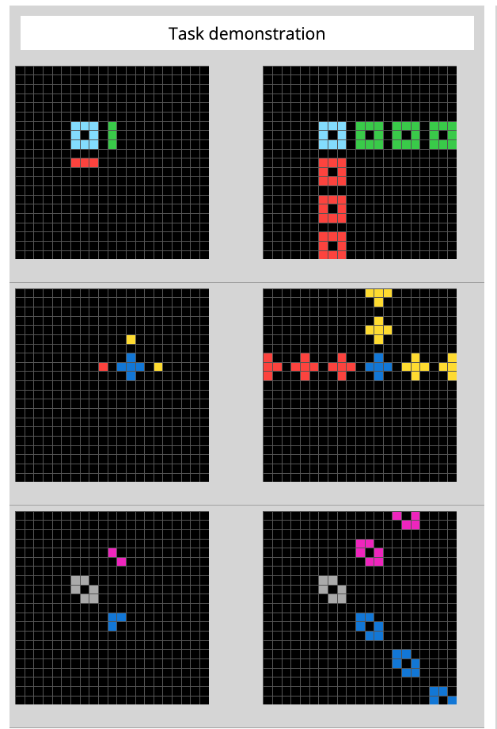
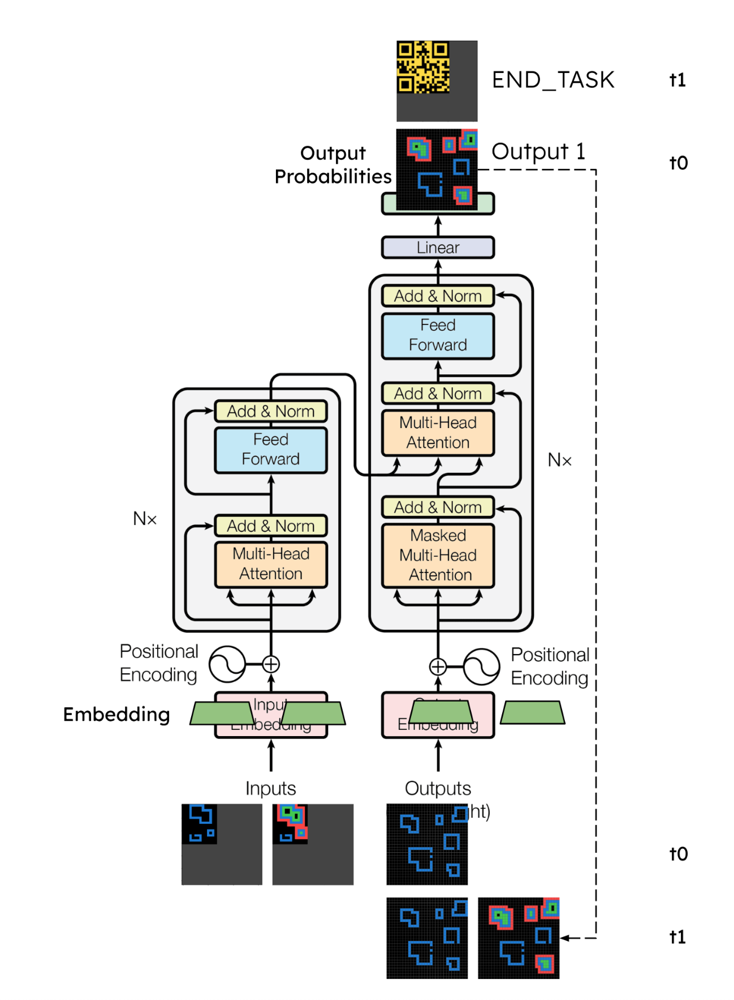
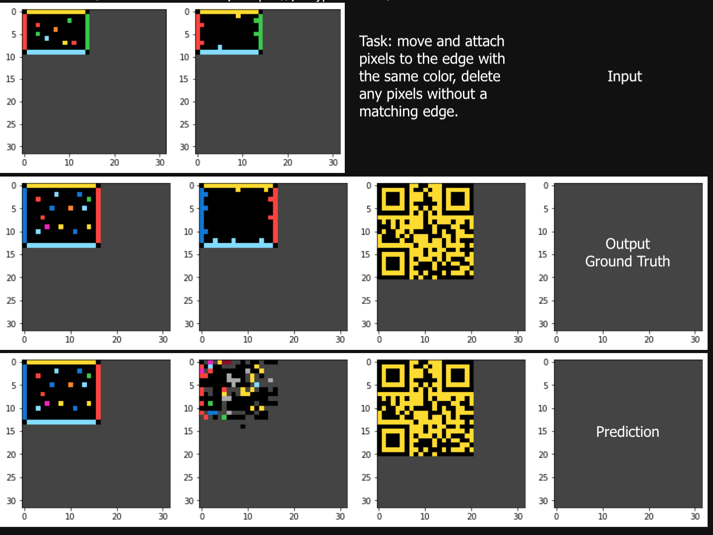

# Applying the Transformer Architecture to the Abstraction Reasoning Challenge 

Note: This is a personal project for my own curiosity and learning, and is not an officially supported Google product.

This is an on-going experiment to find a suitable deep learning architecture to solve visual reasoning tasks from the 2020 Kaggle [Abstraction Reasoning Challenge](https://www.kaggle.com/c/abstraction-and-reasoning-challenge) benchmark. This competition was hosted by [François Chollet](https://fchollet.com/), creator of the Keras neural networks library. [Chollet’s paper on measuring intelligence](https://arxiv.org/abs/1911.01547) provides the context and motivation behind the ARC benchmark.

## Background

A "Reasoning Task" is as follows:

- Three to five “Training” or demonstrational pairs are given, showing how to create "Output” from “Input”.
- At least one “Test” grids with just the Input grid is given.
- For each test grid, complete its Output grid, in the same way the training grids illustrated.

To automatically complete the test grids correctly, for as many tasks as one can, the challenge is for a piece of software to first successfully deduce the steps and rules that map an Input to an Output from the demonstrational grids, followed by applying them to the test Inputs correctly.

A manual exploration testing tool are provided with the competition:

      

## Data

As a Kaggle challenge, the competition provides 400 training and 400 evaluation tasks [(Github)](https://github.com/fchollet/ARC). The public leaderboard was evaluated against a test set of 100 private tasks. 

The 800 tasks provided covers a wide range of visual tasks, from simply changing colors, filling missing regions, fill a shape with color, forming shapes, to more complex reasoning tasks such as deducing the number of lines in the input and return the number in pixels, or use the number to create other shapes… etc.

      
      
      

The approach of the [top scorers](https://www.kaggle.com/competitions/abstraction-and-reasoning-challenge/discussion/154349) involved programming a visual parser and domain specific language (DSL), and only some machine learning were involved.

## Applying a Transformer: My Experiment

The attention mechanism and its capacity of capturing semantics makes Transformer a suitable candidate. The idea is to treat the task much like a seq2seq2 language translation task, where the encoder absorbs and captures the rules / steps to be applied from the Inputs, and the decoder applies the rules step by step to the Output.

A sketch of how the Transformer architecture is currently applied in this experiment. Each input is one training example as a sequence of grids. Each output is a sequence of grids followed by a stop token. The last output from the decoder before the stop token is the predicted task output:

      	
      

## Current Results

This is in its early stage. See [experiments](experiments/JOURNEY.md) for a write up on the journey so far. With just a hastily adopted transformer, the current model is able to memorize some training data, but otherwise does not generalize to test data. There is evidence that the QR code stop token to mark the end of an output sequence is respected even when the output is wrong. There are some sample successes and failures in the [sample_results](sample_results) directory. For example, a success:

      

and a failure:

      

## Files

- arc_transformer.ipynb - The main model building, training and test loops, and results inspection notebook.
- task_packager.ipynb - This scans a given directory for JSON task files, and repackages them into a train / test grids format, in a npz package usable for the arc_transformer code.
- task_generator.ipynb - Generates a few non-ARC tasks with much simpler rule-set and semantics for testing. This allows a larger and simpler dataset to be generated for experimentation. The output follows the ARC task JSON format. A few tasks can be found in the directory [core_knowledge](data/core_knowledge).

