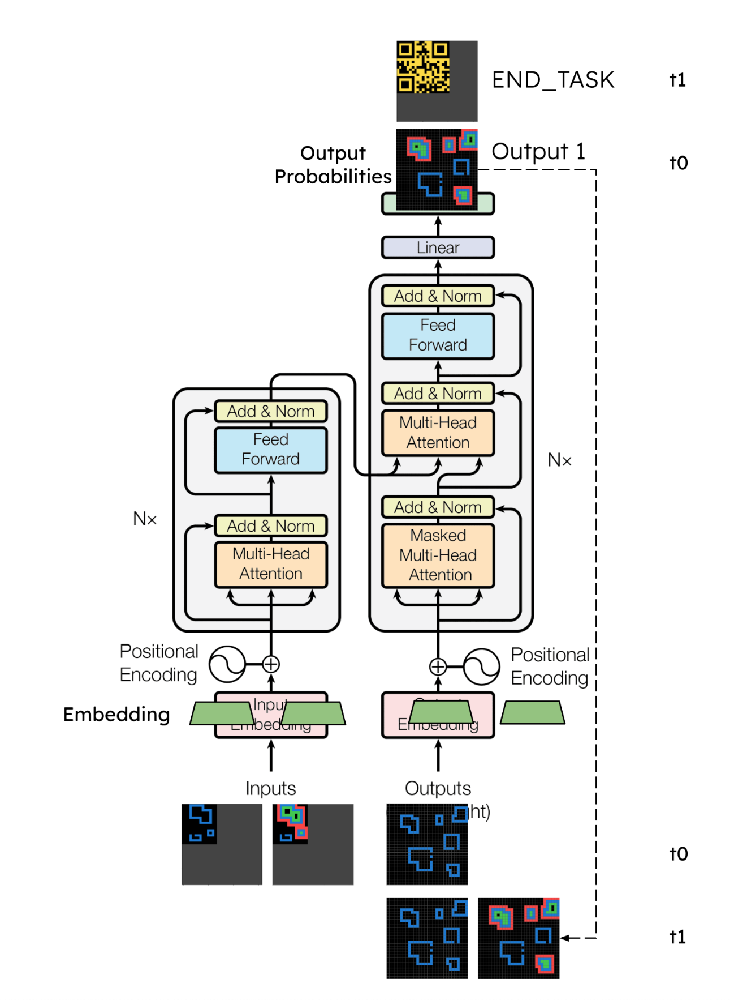
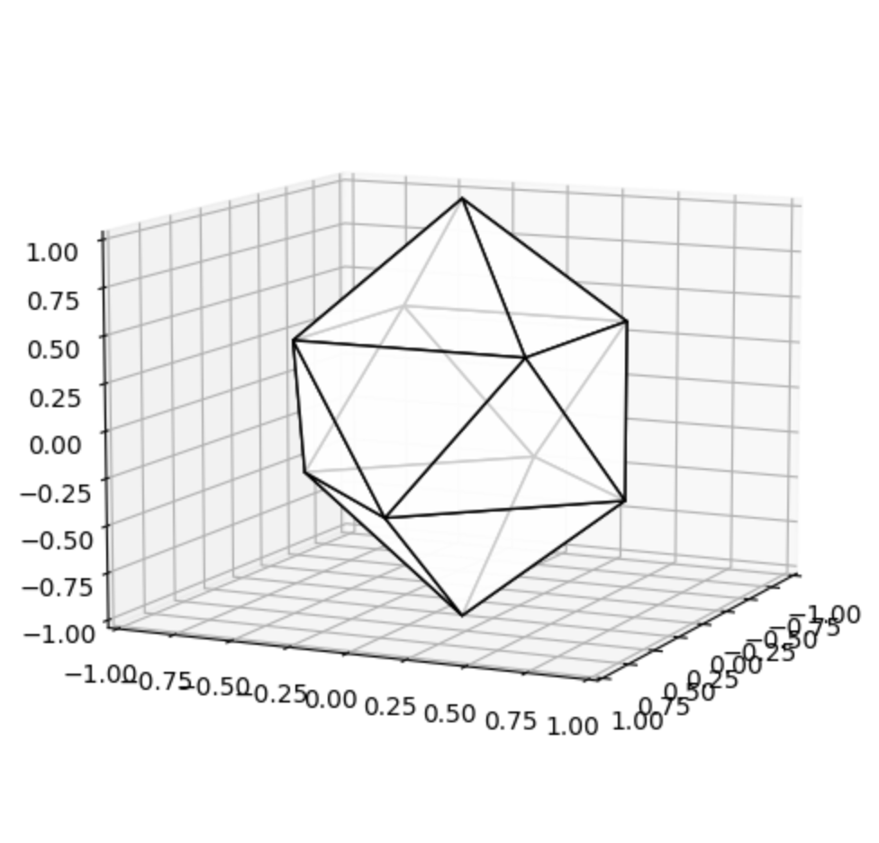
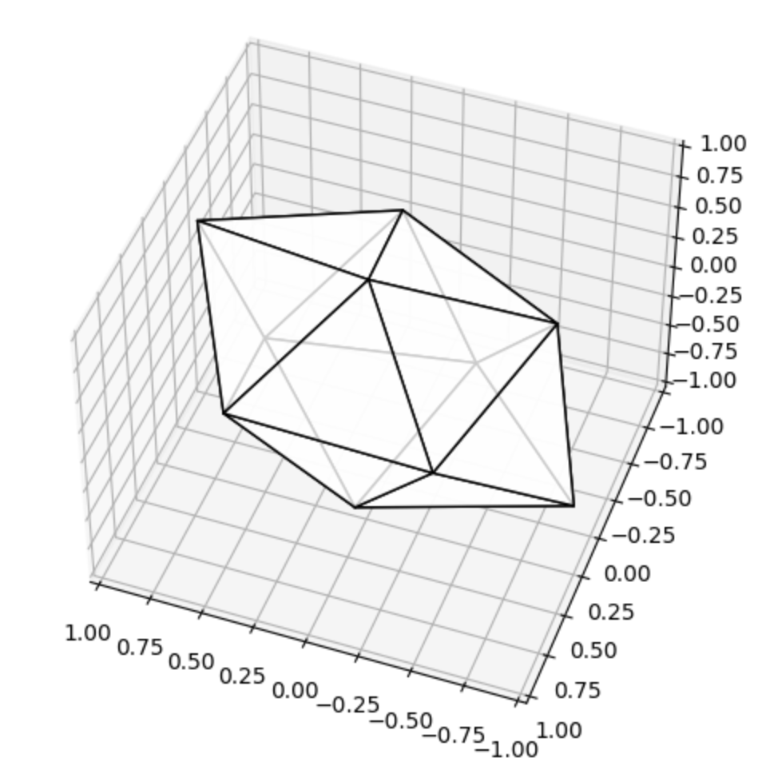

# Approach

1. Quickly get a model up and running with train/test loops, to see what the results look like, gain experience.
1. Reuse existing models before developing from a custom architecture.
1. Synthetic data is expected to be required. The given [ARC benchmark tasks](https://github.com/fchollet/ARC) are not only complex, cover a very large variety of visual understanding and editing operations, the 800 tasks provided are insufficient to train a model to fully learn the operational semantics of most tasks. 
1. Once the initial learning operating a transformer on this data is completed, aim to get some successes in modeling, with a much reduced complexity to simplify the challenge:
	- Small Simple Tasks; Single Step Tasks
	- MonoChrome; Small Grid (or even 1D)
	- Deconstruct the Transformer, test separate model components (Embedding, Attention, Decoder-only)
1. It is expected that different task may demand a slightly different model architecture.
1. Learning the common patterns and re-introduce complexity by recombining architecture variations that were shown workable.

# Phase 1 - Adapt, Learn, and Generate Ideas - DONE

## Adapting a Transformer 

An [open sourced transformer implementation](https://github.com/rojagtap/transformer-abstractive-summarization/blob/master/summarizer.ipynb) was modified (see the [nbdiffs](../archive/base-exp5-diff.pdf)) in the following ways:

   	

- Replaced the Keras text embedding module to a custom 2D to n-dim embedding vector module. The embedding weights are shared across the sequence, input and output.
- Replaced the softmax vocab probabilities output to a Dense-Reshape layer such that it outputs a 2D grid of floating point numbers.
- Some of the reasoning tasks are multi-steps, so we can adapt a seq-2-seq paradigm. To adapt the problem as a sequence generation with a Transformer model, a 2D STOP token was created simply using a QR code.
 

## Feature Engineering

There is no fixed grid size in the original benchmark tasks, often even the outputs are of a different size to the inputs. To adapt them to a neural architecutre, all data grids are standardized into a 32x32 grid, with the original task occupying towards the top left of the grid with non-zero values, and irrelevant grid cells takes the value 0 as a mask.

There are 10 different task colors, plus one for the grid mask we just introduced. Since the discrete colors are meaningless to a deep learning model, we can map the colors in whichever way that is condusive for machine learning. We will simply write bi-directional conversion code to translate to and from the representation.

To determine how to map the original 0-9 color index into a format more condusive for model training, four alternative representations were tested against the same model, with the same hyperparameters and same # epochs, to see which representation yields the most total pixel accuracy (not grids since we are not yet testing learning) at the end of the test, as a proxy for the representation's fitness to be learned:
- Sparse One-Hot (10 dim / pixel), 
- 0-1 RGB (3 dim / pixel), 
- [3D Gyroelongated Square Bipyramid (GSB)](https://en.wikipedia.org/wiki/Gyroelongated_square_bipyramid) (also called - tetrakis-square-antiprism) (3 dim / pixel), and 
- The GSB rotated 45 degrees in all 3 axes to avoid points having any 0 valued coordinate.

The input grid features were re-engineered using the rotated-GSB representation, using a vertex's 3D coordinates to represents a color, and 0,0,0 being the mask. The representation maximizes the vector distance separation between points representing the task colors. 

      	
      

The input embeddings takes the 3D coordinate vector for each pixel and outputs a 1D vector of d_model length (a hyperparameter).

## Metrics

Training loss is the difference between the target grid tensor vs the predicted grid tensor. A straight forward Mean Squared Error is used.

Evaluation metric is binary accuracy whether the predicted sequence is equal to the ground truth sequence, pixel by pixel, in the same order. Pixel color values are recovered from the floating point outputs by mapping the points to the closest vertex in the GSB solid representing a color.

## Experiments

Tested various hyperparamters such as learning rate, drop out, choice of RelU vs PReLU, the vector size of internal representations, and epochs.

Experiment 1: Partially tagged and analyzed the distribution of the training data. Explored the initial model with an “Identity” task, which just copies the Input to the Output. A test to see if the model can indeed correctly learn the association between each input and output grid pixel.

Experiment 2: Explore a few hyperparameters varying #epochs and lr and observing loss. Used Identity tasks.

Experiment 3: Test Dynamic Learning Rate. Used Identity tasks.

Experiment 4: Tested with true ARC Tasks. 
- Analyzed vanishing gradient problem.
- Applied He normal initialization, ReLU / PReLU activation at Dense output layer.
- Explored hyperparamter Dropout between 0.1 and 0.5, embedding dimensions.
- Best Results:
	- Test  Count: 835,  Avg loss: 0.0130, Accuracy: 0 (0.0000),   Stops found: 817
	- Train Count: 5100, Avg loss: 0.0016, Accuracy: 585 (0.1147), Stops found: 5067

Experiment 5: Created new dataset with a single & simple task with only one rule.
- Circle a pixel. Result:
	- Test  Count: 1045, Avg loss: 0.0751, Accuracy: 0 (0.0000), Stops found: 269
	- Train Count: 8775, Avg loss: 0.0760, Accuracy: 0 (0.0000), Stops found: 2360
- Move a pixel to the right. Results:
	- Test  Count: 1051, Avg loss: 0.0153, Accuracy: 0 (0.0000), Stops found: 640
	- Train Count: 8745, Avg loss: 0.0116, Accuracy: 30 (0.0034), Stops found: 5903

## Results

The current model is able to memorize some training data, but otherwise does not generalize to test data. There is evidence that the QR code stop token to mark the end of an output sequence is respected even when the output is wrong. There are some sample successes and failures in the [sample_results](../sample_results) directory. For example, a success:

# Phase 2 - Deconstruct and Reconstruct - WIP

Phase 1 has provided much valuable information about adapting a Transformer for this challenge:
- This initial model is biased and does not generalized at all.
- The hyperparamter space for a transformer is large, 
- The ARC task variety is large, and even for the same task, there can be a large variation, with different pixel patterns, grid sizes... etc. In comparison, the amount of data provided is just a very small non-representative sample. 

In order to understand some of the task, the model would need to be trained on the notions of (non-exhaustive, see Chollet's paper for more ["Core Knowledge Priors"](https://arxiv.org/abs/1911.01547)):
- Foreground vs background color.
- Spatial equivalency vs Regional significance.
- Motifs vs noise.
- Closed shapes vs Open.
- Symmetry.
- Objectness by space and by color.
- Counting Operations.
- Editing Operations such as: Copy, Move, Delete, Add, Wrap.
- Extend along a direction and turning.
- UnMasks.
- Regional and Edge to Pixels Association.

With limited resources, one possible path to make progress is to reduce the complexity to limit the search space, towards smaller and simpler visual grids, and simpler tasks. It could afford a smaller model with a lower resource demands. At the same time it is more likely a comprehensive training dataset covering the variations can be generated.

Reducing complexity of the problem affords better guardrails for experimentation, and opportunity to understand how the model architecture addresses the challenges. 

Currently the following process is adopted. Starting with a minimal model:
1.	Add an incrementally simple task, or an increased difficulty like grid size, variable grid size… etc.
1.	Get smallest model that generalizes to the test set with some accuracy.
1.	Test largest batch size with appropriate LR that maintains accuracy
1.	Test LR schedules and maximum epoch to improve accuracy before overfit
1.	Note best accuracy -> determine if model complexity should be increased, if not go to 7.
1.	If so, try variety of methods: Embedding Layers, d_model /dff, Encoding/ Decoding Layer, additional architectural components, back to 2.
1.	Look at the Kaggle data set, winners’ write up to pick tasks that are likely in the private test set. Pick one.
1.	Repeat 1-6 with a simplified version, 
1.	Repeat 1-6 with a realistic version, 
1.	Test with ARC Train and Eval Set, 
1.	Test with Kaggle private test.

# Relevant Literature

A continuation of the ARC challenge. Lab42, 2023. https://lab42.global/arc/

I-JEPA: The first AI model based on Yann LeCun’s vision for more human-like AI. Yann LeCun, Meta, June 2023. https://ai.meta.com/blog/yann-lecun-ai-model-i-jepa/

Large Language Model (LLM) as a System of Multiple Expert Agents: An Approach to solve the Abstraction and Reasoning Corpus (ARC) Challenge. John Chong Min Tan, Mehul Motani, National University of Singapore, Oct 2023. https://arxiv.org/abs/2310.05146

A review of emerging research directions in Abstract Visual Reasoning - Mikołaj Małkiński a, Jacek Mańdziuk. Warsaw University of Technology, March 2022. https://arxiv.org/pdf/2202.10284.pdf 

Hybrid computing using a neural network with dynamic external memory. Graves et al, DeepMind. Nature, 2016. https://www.nature.com/articles/nature20101
